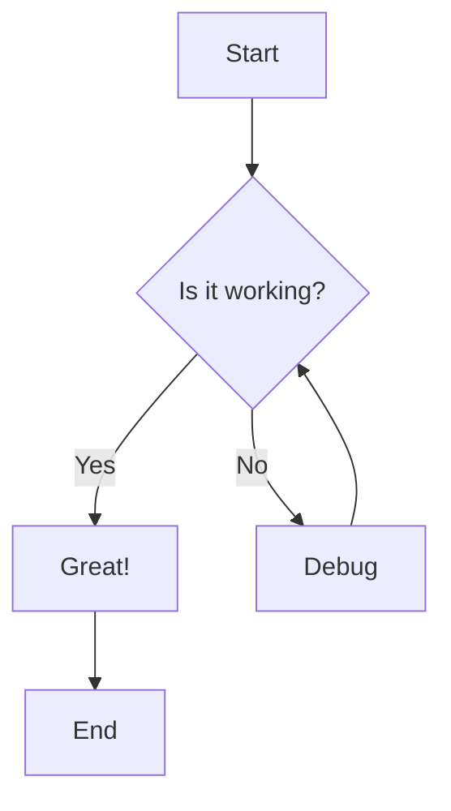
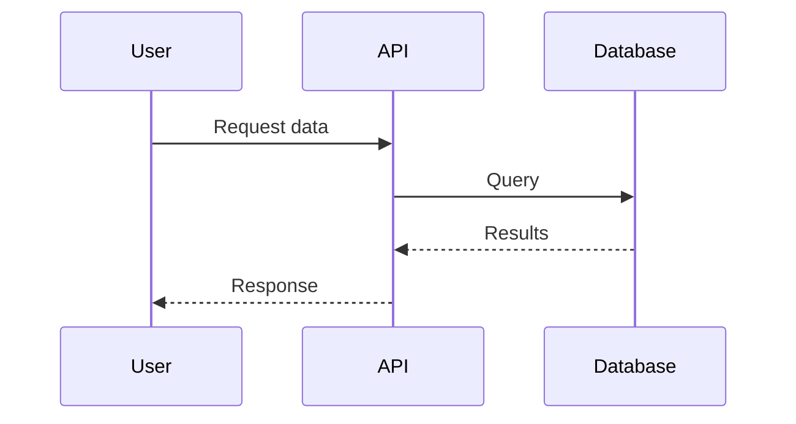
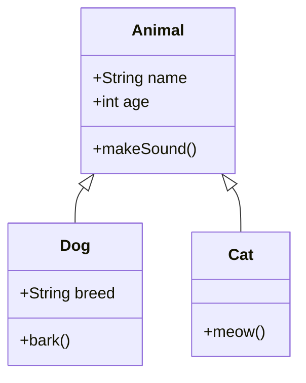
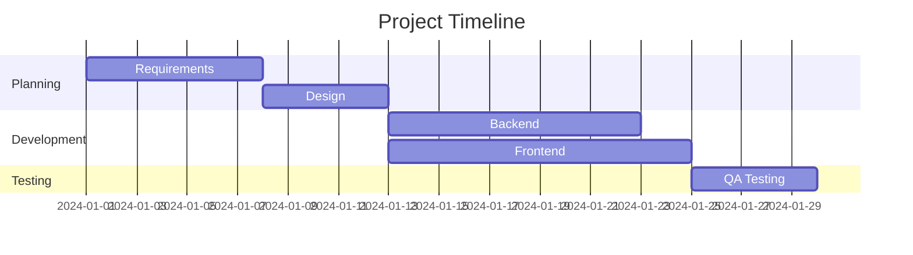

# Mermaid Diagram Examples

Mermaid renders in GitHub, GitLab, Notion, and many markdown viewers.

## Flowchart

## Sequence Diagram

## Class Diagram

## Gantt Chart

## To render as image:
Use Mermaid CLI: `mmdc -i diagram.mmd -o diagram.png`
Or use online editor: https://mermaid.live
