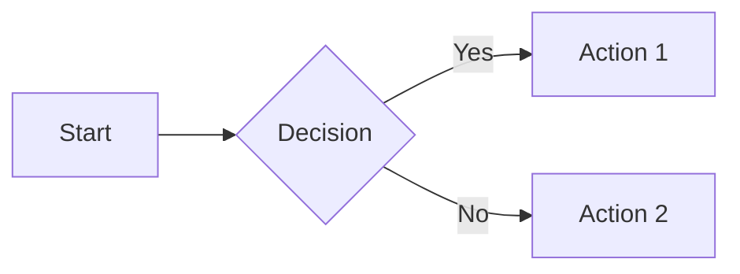

# Quick Reference Guide

## When to Use What

### Static Diagrams
- **Mermaid** - Best for documentation, GitHub/GitLab
- **PlantUML** - UML diagrams, architecture docs
- **SVG** - Custom graphics, logos, icons
- **Graphviz** - Network graphs, dependencies

### Data Visualization
- **Matplotlib** (Python) - Scientific plots, publications
- **Plotly** (Python/JS) - Interactive dashboards
- **D3.js** - Custom interactive visualizations
- **Chart.js** - Simple, clean web charts

### Animations & Art
- **P5.js** - Creative coding, generative art
- **Canvas API** - Game graphics, animations
- **Three.js** - 3D graphics
- **Manim** - Mathematical animations

### Cloud/Architecture
- **Diagrams** (Python) - Cloud infrastructure
- **Excalidraw** - Hand-drawn style diagrams
- **Draw.io** - General purpose diagrams

## Installation Commands

```bash
# Python packages
pip install matplotlib numpy pandas
pip install plotly
pip install diagrams
pip install pillow

# Node.js packages
npm install d3
npm install chart.js
npm install three
npm install p5

# CLI tools
npm install -g @mermaid-js/mermaid-cli
brew install graphviz
brew install imagemagick
```

## Export Formats

| Tool | PNG | SVG | PDF | HTML | Interactive |
|------|-----|-----|-----|------|-------------|
| Mermaid | ✓ | ✓ | ✓ | ✓ | ✗ |
| Matplotlib | ✓ | ✓ | ✓ | ✗ | ✗ |
| Plotly | ✓ | ✓ | ✓ | ✓ | ✓ |
| D3.js | ✓ | ✓ | ✗ | ✓ | ✓ |
| SVG | ✗ | ✓ | ✓ | ✓ | ✗ |
| Canvas | ✓ | ✗ | ✗ | ✓ | ✓ |

## Code Snippet Templates

### Quick Mermaid Flowchart


### Quick Python Chart
```python
import matplotlib.pyplot as plt
plt.plot([1, 2, 3], [4, 5, 6])
plt.savefig('chart.png')
```

### Quick HTML Canvas
```javascript
const canvas = document.getElementById('canvas');
const ctx = canvas.getContext('2d');
ctx.fillStyle = 'blue';
ctx.fillRect(10, 10, 100, 100);
```

### Quick SVG
```html
<svg width="100" height="100">
  <circle cx="50" cy="50" r="40" fill="blue" />
</svg>
```

## Online Tools (No Installation)

- **Mermaid Live**: https://mermaid.live
- **Excalidraw**: https://excalidraw.com
- **QuickChart**: https://quickchart.io
- **Carbon**: https://carbon.now.sh (code screenshots)
- **Figma**: https://figma.com (design tool)

## Tips for Social Media

1. **Size matters**: Use 1200x630 for social sharing
2. **High DPI**: Export at 2x or 3x for retina displays
3. **Formats**: PNG for screenshots, SVG for scalability
4. **Colors**: Use high contrast for readability
5. **Text**: Keep it large and legible
6. **Branding**: Add watermark or logo
7. **Accessibility**: Include alt text descriptions
