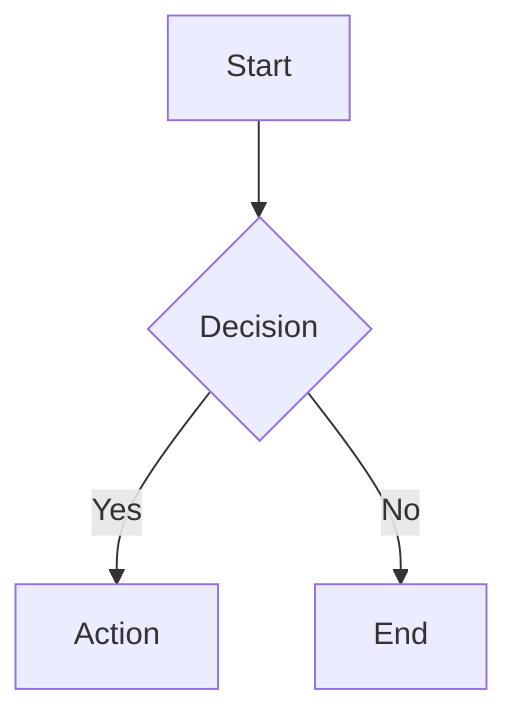

# Complete Visualization & Infographic Creation Guide

**Master Documentation - Everything You Need to Create Visual Content**

---

## 📚 Table of Contents

1. [Quick Start](#quick-start)
2. [Project Overview](#project-overview)
3. [Tools & Technologies](#tools--technologies)
4. [Creating Visualizations](#creating-visualizations)
5. [Creating GIFs](#creating-gifs)
6. [Text to Infographic Conversion](#text-to-infographic-conversion)
7. [AI Prompts & Automation](#ai-prompts--automation)
8. [Agentic Approaches](#agentic-approaches)
9. [Best Practices](#best-practices)
10. [Resources](#resources)

---

## Quick Start

### For Beginners
1. **Want to create diagrams?** → Open `1-mermaid-examples.md` and paste into GitHub
2. **Want to make GIFs?** → Open `13-canvas-to-gif.html` in your browser
3. **Want infographics?** → Use Canva.com with prompts from `16-prompt-library.md`

### For Developers
1. **Python visualizations** → Run `python 3-matplotlib-charts.py`
2. **Interactive web charts** → Open `4-d3-interactive.html`
3. **Automated infographics** → Run `python 15-agentic-infographic-system.py`

### For AI Users
1. **Text to diagram** → Use prompts from `16-prompt-library.md` with ChatGPT
2. **Automated workflow** → Follow `14-text-to-infographic-guide.md` Part 6
3. **Multi-agent system** → Study `15-agentic-infographic-system.py`

---

## Project Overview

### What's Included

This project contains **17 comprehensive files** covering:

#### Visualization Examples (Files 1-10)
- **Mermaid diagrams** - Text-based flowcharts, sequences, Gantt charts
- **Python visualizations** - Cloud architecture, data charts, statistical plots
- **JavaScript/HTML** - D3.js, SVG, Canvas animations, Chart.js, P5.js
- **Quick reference** - Installation commands, use cases, comparisons

#### GIF Creation (Files 11-13)
- **Complete guide** - Online tools, command-line, Python, JavaScript
- **Python examples** - 5 ready-to-run GIF generators
- **Browser tool** - Interactive HTML GIF creator

#### Infographic Creation (Files 14-17)
- **Conversion guide** - Text to infographic methodology
- **Agentic system** - Multi-agent Python implementation
- **Prompt library** - 20+ tested AI prompts
- **Master documentation** - This file

### File Structure

```
visualization-examples/
├── 1-mermaid-examples.md              # Text-based diagrams
├── 2-python-diagrams.py               # Cloud architecture
├── 3-matplotlib-charts.py             # Data visualization
├── 4-d3-interactive.html              # Interactive charts
├── 5-svg-direct.html                  # Direct SVG graphics
├── 6-canvas-animation.html            # Canvas animations
├── 7-plotly-interactive.py            # Interactive dashboards
├── 8-chartjs-example.html             # Chart.js examples
├── 9-p5js-generative.html             # Generative art
├── 10-quick-reference.md              # Quick reference guide
├── 11-gif-creation-guide.md           # Complete GIF guide
├── 12-python-gif-creator.py           # Python GIF examples
├── 13-canvas-to-gif.html              # Browser GIF creator
├── 14-text-to-infographic-guide.md    # Infographic conversion
├── 15-agentic-infographic-system.py   # Multi-agent system
├── 16-prompt-library.md               # AI prompt collection
└── 17-master-documentation.md         # This file
```

---

## Tools & Technologies

### By Use Case

#### Static Diagrams
| Tool | Best For | Difficulty | Output |
|------|----------|------------|--------|
| Mermaid | Documentation | Easy | SVG, PNG |
| PlantUML | UML diagrams | Medium | PNG, SVG |
| Graphviz | Network graphs | Medium | PNG, SVG |
| SVG | Custom graphics | Medium | SVG |

#### Data Visualization
| Tool | Best For | Difficulty | Output |
|------|----------|------------|--------|
| Matplotlib | Scientific plots | Easy | PNG, PDF |
| Plotly | Interactive dashboards | Medium | HTML, PNG |
| D3.js | Custom visualizations | Hard | HTML, SVG |
| Chart.js | Simple web charts | Easy | HTML |

#### Animations & GIFs
| Tool | Best For | Difficulty | Output |
|------|----------|------------|--------|
| Canvas API | Web animations | Medium | HTML |
| P5.js | Creative coding | Easy | HTML |
| Python Pillow | Simple GIFs | Easy | GIF |
| FFmpeg | Video to GIF | Medium | GIF |

#### Infographics
| Tool | Best For | Difficulty | Output |
|------|----------|------------|--------|
| Canva | Quick designs | Easy | PNG, PDF |
| Figma | Professional design | Medium | PNG, SVG |
| Python/Matplotlib | Programmatic | Medium | PNG |
| AI Tools | Automated | Easy | Various |

---

## Creating Visualizations

### Method 1: Text-Based (Mermaid)

**Pros:** Fast, version-controlled, works in GitHub/GitLab
**Cons:** Limited styling options

**Example:**


**Files:** `1-mermaid-examples.md`

### Method 2: Python (Matplotlib/Plotly)

**Pros:** Programmatic, reproducible, great for data
**Cons:** Requires Python knowledge

**Example:**
```python
import matplotlib.pyplot as plt
plt.plot([1, 2, 3], [4, 5, 6])
plt.savefig('chart.png')
```

**Files:** `3-matplotlib-charts.py`, `7-plotly-interactive.py`

### Method 3: JavaScript (D3.js/Chart.js)

**Pros:** Interactive, web-native, responsive
**Cons:** Requires web development skills

**Example:**
```javascript
new Chart(ctx, {
    type: 'bar',
    data: { labels: ['A', 'B'], datasets: [{data: [10, 20]}] }
});
```

**Files:** `4-d3-interactive.html`, `8-chartjs-example.html`

### Method 4: Direct SVG

**Pros:** Scalable, precise control, lightweight
**Cons:** Verbose, manual positioning

**Example:**
```html
<svg width="100" height="100">
    <circle cx="50" cy="50" r="40" fill="blue" />
</svg>
```

**Files:** `5-svg-direct.html`

---

## Creating GIFs

### Quick Methods

#### 1. Online Tools (Easiest)
- **Ezgif.com** - Upload images or video
- **Giphy.com** - Create and share
- **Canva.com** - Design animated graphics

#### 2. Browser Tool (No Installation)
- Open `13-canvas-to-gif.html`
- Choose animation type
- Click "Create GIF"
- Download result

#### 3. Python Script (Automated)
```bash
pip install pillow imageio matplotlib numpy
python 12-python-gif-creator.py
```

Creates 5 different GIF types automatically.

#### 4. Command Line (Most Powerful)
```bash
# Video to GIF
ffmpeg -i input.mp4 -vf "fps=10,scale=320:-1" output.gif

# Images to GIF
convert -delay 10 -loop 0 *.png output.gif
```

### Detailed Guide
See `11-gif-creation-guide.md` for:
- Installation instructions
- Optimization techniques
- Platform-specific sizes
- Quality vs file size trade-offs

---

## Text to Infographic Conversion

### The Process

#### Step 1: Analyze Your Text
```
Input: "First, plan your project. Then, execute the plan. 
        Finally, review the results."

Analysis:
- Type: Sequential process
- Key points: 3 steps
- Best format: Flowchart or timeline
- Suggested colors: Blue (trust) + Orange (action)
```

#### Step 2: Choose Visualization Type

| Text Contains | Use This |
|---------------|----------|
| "First, then, next" | Flowchart, Timeline |
| "X vs Y" | Comparison chart |
| "50%, 30%, 20%" | Pie chart, Bar chart |
| "Top 5 reasons" | Numbered list with icons |
| "Over time" | Timeline, Line graph |

#### Step 3: Create the Visual

**Option A: Use AI Tools**
```
Prompt: "Create a 3-step process infographic for:
1. Plan your project
2. Execute the plan
3. Review the results

Style: Modern, blue and orange colors, horizontal layout"
```

**Option B: Use Code**
```python
system = InfographicAgentSystem()
fig = system.create_infographic(your_text)
fig.savefig('infographic.png')
```

**Option C: Use Templates**
- Canva templates
- Visme templates
- Piktochart templates

### Detailed Guide
See `14-text-to-infographic-guide.md` for:
- Design principles
- AI tool comparisons
- Prompt engineering
- Automated workflows

---

## AI Prompts & Automation

### Best Prompts by Tool

#### ChatGPT/Claude
```
Convert this text into a Mermaid diagram:
[YOUR TEXT]

Requirements:
- Choose appropriate diagram type
- Use colors for emphasis
- Add clear labels
- Make it visually balanced
```

#### DALL-E/Midjourney
```
Professional infographic design, [TOPIC], 
clean modern layout, flat design style,
color palette: navy blue and orange,
minimalist aesthetic, white background,
aspect ratio 2:3, 8k resolution
```

#### Canva AI
```
Create a social media infographic about [TOPIC]:
- Eye-catching title
- 3-5 key statistics
- Modern design
- Optimized for Instagram (1080x1080px)
```

### Prompt Library
See `16-prompt-library.md` for:
- 20+ tested prompts
- Multi-step workflows
- Style modifiers
- Quality tips

---

## Agentic Approaches

### What is an Agentic System?

An AI system with multiple specialized agents working together:

```
Text Input
    ↓
[Analyzer] → Extracts concepts
    ↓
[Strategist] → Plans visualization
    ↓
[Designer] → Creates visual
    ↓
[Optimizer] → Refines output
    ↓
Final Infographic
```

### Implementation

#### Basic Example
```python
from infographic_system import InfographicAgentSystem

system = InfographicAgentSystem()
result = system.create_infographic(
    text="Your text here",
    preferences={'style': 'modern', 'colors': ['#2C3E50', '#3498DB']}
)
result.save('output.png')
```

#### Advanced Frameworks

**LangChain**
```python
from langchain.agents import initialize_agent
agent = initialize_agent(tools, llm, agent="zero-shot-react")
result = agent.run("Create infographic about AI trends")
```

**AutoGen**
```python
import autogen
groupchat = autogen.GroupChat(
    agents=[analyzer, designer, critic],
    max_round=10
)
```

**CrewAI**
```python
from crewai import Agent, Task, Crew
crew = Crew(
    agents=[analyst, designer, reviewer],
    tasks=[analyze_task, design_task, review_task]
)
```

### Full Implementation
See `15-agentic-infographic-system.py` for:
- Complete multi-agent system
- Working examples
- Extensible architecture
- Production considerations

---

## Best Practices

### Design Principles

#### Visual Hierarchy
1. **Most important** → Largest, boldest, top
2. **Supporting info** → Medium size, middle
3. **Details** → Smallest, bottom

#### Color Usage
- **3-5 colors maximum**
- Use color wheel for harmony
- Ensure WCAG AA contrast (4.5:1)
- Test for colorblindness

#### Typography
- **Headers:** Bold, large (24-36pt)
- **Body:** Regular, readable (12-16pt)
- **Max 2-3 font families**
- Sans-serif for digital, serif for print

#### White Space
- Don't fill every pixel
- Group related elements
- Use margins and padding
- Let content breathe

### Technical Best Practices

#### File Optimization
```bash
# Optimize PNG
pngquant image.png --quality=65-80

# Optimize GIF
gifsicle -O3 --colors 256 input.gif -o output.gif

# Optimize SVG
svgo input.svg -o output.svg
```

#### Responsive Design
```css
/* Mobile first */
.infographic {
    width: 100%;
    max-width: 600px;
}

@media (min-width: 768px) {
    .infographic {
        max-width: 1200px;
    }
}
```

#### Accessibility
- Add alt text to all images
- Use semantic HTML
- Ensure keyboard navigation
- Provide text alternatives
- Test with screen readers

### Platform-Specific

#### Social Media
- **Instagram:** 1080x1080px (square) or 1080x1920px (story)
- **Twitter:** 1200x675px (16:9)
- **LinkedIn:** 1200x627px
- **Pinterest:** 1000x1500px (2:3)

#### Web
- **Hero images:** 1920x1080px
- **Blog posts:** 1200x630px
- **Thumbnails:** 300x200px
- **Icons:** 64x64px or SVG

#### Print
- **Poster:** 18x24 inches at 300 DPI
- **Flyer:** 8.5x11 inches at 300 DPI
- **Business card:** 3.5x2 inches at 300 DPI

---

## Resources

### Learning Paths

#### Beginner Path
1. Start with Mermaid diagrams (`1-mermaid-examples.md`)
2. Try online tools (Canva, Ezgif)
3. Use browser-based creators (`13-canvas-to-gif.html`)
4. Experiment with AI prompts (`16-prompt-library.md`)

#### Intermediate Path
1. Learn Python visualization (`3-matplotlib-charts.py`)
2. Create interactive charts (`4-d3-interactive.html`)
3. Build GIF animations (`12-python-gif-creator.py`)
4. Study infographic design (`14-text-to-infographic-guide.md`)

#### Advanced Path
1. Master D3.js and Canvas API
2. Build agentic systems (`15-agentic-infographic-system.py`)
3. Create custom automation workflows
4. Develop production-ready tools

### Tools & Software

#### Free Tools
- **Canva** - Design platform (free tier)
- **Figma** - Design tool (free for individuals)
- **GIMP** - Image editor (open source)
- **Inkscape** - Vector graphics (open source)
- **Blender** - 3D graphics (open source)

#### Paid Tools
- **Adobe Creative Suite** - Industry standard
- **Sketch** - macOS design tool
- **Affinity Designer** - One-time purchase
- **Visme** - Infographic platform
- **Piktochart** - Infographic maker

#### Developer Tools
- **Python:** matplotlib, plotly, pillow, imageio
- **JavaScript:** D3.js, Chart.js, Three.js, P5.js
- **CLI:** FFmpeg, ImageMagick, Gifsicle
- **AI:** OpenAI API, Anthropic Claude, Stable Diffusion

### Online Resources

#### Documentation
- Mermaid: https://mermaid.js.org
- D3.js: https://d3js.org
- Matplotlib: https://matplotlib.org
- Chart.js: https://chartjs.org

#### Inspiration
- Dribbble: https://dribbble.com
- Behance: https://behance.net
- Pinterest: https://pinterest.com
- Information is Beautiful: https://informationisbeautiful.net

#### Learning
- DataCamp (data visualization)
- Frontend Masters (web graphics)
- Coursera (design courses)
- YouTube (tutorials)

#### Assets
- Font Awesome (icons)
- Unsplash (photos)
- Flaticon (icons)
- Google Fonts (typography)
- Coolors (color palettes)

---

## Quick Reference Commands

### Installation
```bash
# Python packages
pip install matplotlib plotly pillow imageio numpy pandas diagrams

# Node.js packages
npm install d3 chart.js three p5

# CLI tools
brew install ffmpeg imagemagick gifsicle
npm install -g @mermaid-js/mermaid-cli
```

### Common Operations
```bash
# Create GIF from video
ffmpeg -i video.mp4 -vf "fps=10,scale=640:-1" output.gif

# Create GIF from images
convert -delay 10 -loop 0 *.png output.gif

# Optimize GIF
gifsicle -O3 input.gif -o output.gif

# Mermaid to PNG
mmdc -i diagram.mmd -o output.png

# Python chart
python -c "import matplotlib.pyplot as plt; plt.plot([1,2,3]); plt.savefig('chart.png')"
```

---

## Troubleshooting

### Common Issues

#### "Module not found"
```bash
pip install [module-name]
# or
npm install [package-name]
```

#### "Command not found"
```bash
# macOS
brew install [tool-name]

# Linux
sudo apt install [tool-name]
```

#### "GIF too large"
```bash
# Reduce size
gifsicle -O3 --colors 128 --scale 0.5 input.gif -o output.gif
```

#### "Low quality output"
```python
# Increase DPI
plt.savefig('output.png', dpi=300)
```

#### "Slow rendering"
- Reduce number of data points
- Simplify visualizations
- Use sampling for large datasets
- Optimize code loops

---

## Next Steps

### Immediate Actions
1. ✅ Choose your use case (diagrams/charts/GIFs/infographics)
2. ✅ Pick the appropriate file from this project
3. ✅ Follow the examples and modify for your needs
4. ✅ Share your creations!

### Further Learning
1. Study the detailed guides in each file
2. Experiment with different tools and styles
3. Build your own automation workflows
4. Contribute improvements to this project

### Get Help
- Review the specific file for your use case
- Check the troubleshooting section
- Search for tool-specific documentation
- Ask AI assistants with prompts from `16-prompt-library.md`

---

## Project Statistics

- **Total Files:** 17
- **Code Examples:** 50+
- **AI Prompts:** 20+
- **Tools Covered:** 30+
- **Lines of Code:** 3000+
- **Documentation Pages:** 100+

---

## Credits & License

This project is a comprehensive educational resource for creating visualizations, GIFs, and infographics using various tools and techniques.

**Created:** 2024
**Purpose:** Educational and practical reference
**License:** Use freely for learning and projects

---

## Feedback & Contributions

Found this helpful? Have suggestions?
- Improve the examples
- Add new techniques
- Share your creations
- Report issues

---

**Happy Creating! 🎨📊🎬**
